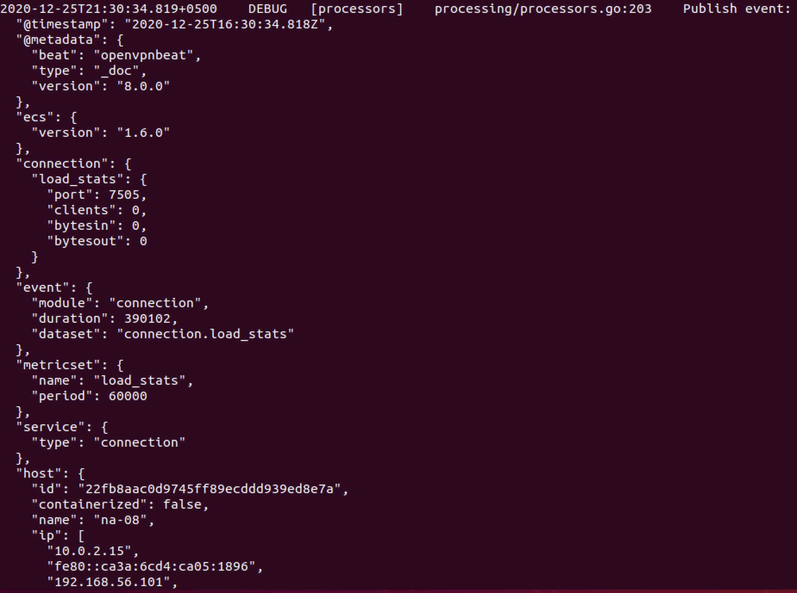

# openvpnbeat

Openvpnbeat is a light weight data shipper for Openvpn metrics. It is based on metricbeat structure.

This beat provides metric collection of Openvpn `load-stats` metrics. Also you need to do is to add ports of OpenVPN management interface in config

### Configuration
Set the configuration options from modules.d/connection.yml.
```bash
# specify management interface ports
ports: ["7505"]
```

### Output
Generated Output


## Getting started

### Requirements

Follow this [link](https://www.elastic.co/guide/en/beats/devguide/current/creating-beat-from-metricbeat.html) to complete requirements

### Build

To compile your beat run `mage build`

### Enable Module

Run this command to enable `connection` module
```bash
./openvpnbeat modules enable connection
```

### Run

To run openvpnbeat with debugging output enabled, run:
```
./openvpnbeat -e -d "*"
```
### Add Metricset

In case further modules are metricsets should be added, run:

```
make create-metricset
```

After updates to the fields or config files, always run

```
mage update
```

This updates all fields and docs with the most recent changes.

## Dependency management

Beats uses go modules for dependency management.

In order to maintain your `vendor` folder, run `mage copyVendor`.

This will create a directory `vendor` inside your repository. To make sure all dependencies for the Makefile commands are loaded from the vendor directory, find the following line in your Makefile:

```
ES_BEATS=${GOPATH}/src/github.com/elastic/beats
```

Replace it with:
```
ES_BEATS=./vendor/github.com/elastic/beats/v7
```


## Versioning

We recommend to version your repository with git and make it available on Github so others can also use your project. The initialise the git repository and add the first commits, you can use the following commands:

```
git init
git add README.md CONTRIBUTING.md
git commit -m "Initial commit"
git add LICENSE
git commit -m "Add the LICENSE"
git add .gitignore
git commit -m "Add git settings"
git add .
git reset -- .travis.yml
git commit -m "Add openvpnbeat"
```

## Packaging

The beat frameworks provides tools to crosscompile and package your beat for different platforms. This requires [docker](https://www.docker.com/) and vendoring as described above. To build packages of your beat, run the following command:

```
make release
```

This will fetch and create all images required for the build process. The hole process to finish can take several minutes.
